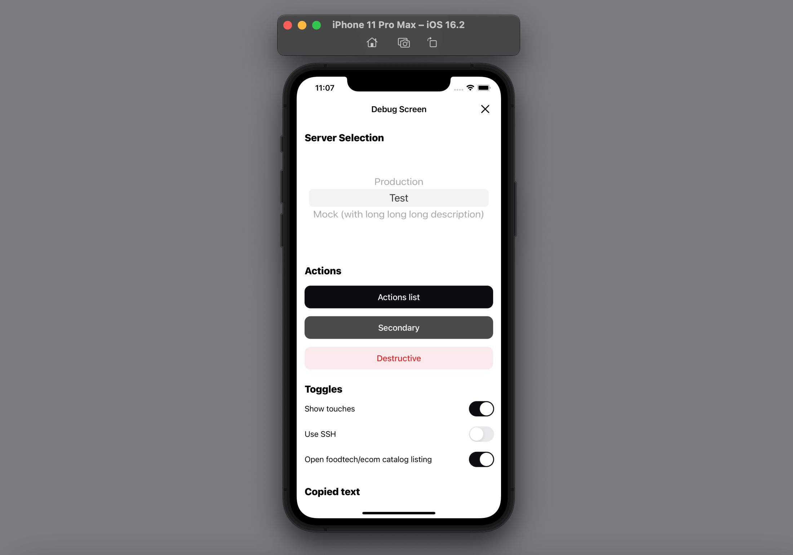

# DebugScreen

[](https://github.com/surfstudio/debug-screen-ios/actions/workflows/main.yml)
[](https://surfstudio.github.io/debug-screen-ios/)
[](https://github.com/apple/swift-package-manager)
[](https://cocoapods.org)

[](https://github.com/surfstudio/debug-screen-ios)

## About

Library for quickly creating and customizing an application`s debug screen. It allows you to customize your DebugScreen as you want.

## Screenshots



## Installation

#### Swift Package Manager

- Open your Xcode project and select `File > Add Packages...`
- Enter repository URL `https://github.com/surfstudio/DebugScreen`

#### CocoaPods:

Add following string into your Podfile and run `pod install` command:

```ruby
pod 'DebugScreen'
```

## Features

Library has different components for create debug screen with functionality that you need.

### Available blocks

- **Action** - Allows you to perform some action on button tap
- **ActionsList** - Provides custom actions list, that will be opened on button tap
- **CopiedText** - Allows to add tapable text, that will be copied to clipboard on tap
- **FeatureToggle** - Provides toggles for activate / disable your application features
- **SelectionList** - Allows you to implement element selection from list (using UIPickerView)

Also library has ready-to-use components, can be used for building logger section.

### Services

- **Logger** - Allows you to catch and get all logs from the Xcode console output
- **Presenter** - Provides functionality for open DebugScreen, logs file and show simple alerts with messages 

## Example

All of this you can see in our Example-project. 

Download repository and run command `make init` before start. It's needed for project correct setup and work.

## Usage

### Operations

<details>
<summary>Details</summary>

#### Content configuration

<details>
<summary>Details</summary>

Components of DebugScreen are separated by sections. You can combine components of different types inside one section.

To configure DebugScreen section you'll need to follow next steps:
- add instances, that implements protocols of needed components (in other words, create models for your blocks)
- add instances, that implements `SectionBuilder` protocol. It has only one function `build() -> TableSection`, inside which you can configure section the way you want.

  **Every section need its own builder!**
- build sections and set them into DebugScreen `sections` property

Common way of content configuration may look like this:
 
```swift
func configureDebugScreen() {
    DebugScreenConfiguration.shared.logCatcherService.isActive = true
    configureDebugScreenSections()
}

func configureDebugScreenSections() {
    let serverSelectionSection = ServerSelectionSectionBuilder().build()
    let actionsSection = ActionsSectionBuilder().build()
    let togglesSection = TogglesSectionBuilder().build()
    let copiedTextSection = CopiedTextSectionBuilder().build()

    DebugScreenConfiguration.shared.sections = [serverSelectionSection,
                                                actionsSection,
                                                togglesSection,
                                                copiedTextSection]
}
```
Here we are implement builders for every needed section, build them and then add into sections array.

**Sections will be displayed on the screen in the same order as they are in the array!**  
  
</details>

#### Open Debug screen

<details>
<summary>Details</summary>

Debug screen can be opened two ways - programmatically or on device shake.

##### Programmatically

For programmatically opening you'll need to call next function:
```swift
DebugScreenPresenterService.shared.showDebugScreen()
```
##### On device shake

For open debug screen on device shake you'll need to activate this feature next way:
```swift
DebugScreenConfiguration.shared.isEnabledOnShake = true
```
By default this property is `false`.
</details>

#### Logging

<details>
<summary>Details</summary>
    
Library has a logger service. It allows you to duplicate informational messages and error messages that are displayed in the Xcode console into a file.

##### Enable / Disable logger
  
To enable the logger, run the following command:
```swift
DebugScreenConfiguration.shared.logCatcherService.isActive = true
```
To disable logger, set `isActive` property into `false`:
```swift
DebugScreenConfiguration.shared.logCatcherService.isActive = false
```

**By default logger is disabled!** 
  
##### Logging settings  
  
By default logger write info and error messages into file. But you can on / off any of this options.
  
To disable catching info messages, set `writeInfoMessages` property of `logCatcherService` into `false`:
```swift
DebugScreenConfiguration.shared.logCatcherService.writeInfoMessages = false
```
To disable catching error messages, set `writeErrorMessages` property of `logCatcherService` into `false`:
```swift
DebugScreenConfiguration.shared.logCatcherService.writeErrorMessages = false
```  

##### Manage logs
  
To open log file from any place of your app call `openLogFile()` function:
```swift
DebugScreenPresenterService.shared.openLogFile()
```
  
To get a list of logs in string form, you can use the function `logs()`:   
```swift
let logs = DebugScreenConfiguration.shared.logCatcherService.logs()
```

In order to clear the log file, you can call the function `clearLogFile`:
```swift
DebugScreenConfiguration.shared.logCatcherService.clearLogFile { [weak self] isSuccess in
    let message = isSuccess ?
        "Clear complete" :
        "Some problems with clear log file"
    DebugScreenPresenterService.shared.showAlert(with: message)
}
```

The only parameter of this function - closure `onClearComplete: ((Bool) -> Void)?` will be called after clear process end and returns true / false according to operation result. Default value of this parameter - nil.

At the moment, errors related to the setup of constraints are not written to the log file. The log file won't include messages containing the following keywords:
- LayoutConstraints
- UIViewAlertForUnsatisfiableConstraints

However, they will still be displayed in the Xcode console.
</details>

</details>

### Components

<details>
<summary>Details</summary>

#### Action

<details>
<summary>Details</summary>
    
Allows you to perform some action on button tap. Actions can be Void or non-Void. 
To implement Void action set `block` property result type to `Void`:
 ```swift
let block: (() -> Void)?
 ```

To implement non-void action, set `block` result type to type you need:
 ```swift
let block: (() -> UIViewController)?
 ```

If you want to open some screen on action buttop tap, just create model, that implements `Action` protocol with `UIViewController` action block result type. Also you can add non-void actions into actions list.

For using it you'll need to do next:
- create instance, that implements `Action` protocol (it will be model of your action)

```swift
import DebugScreen
import UIKit

/// Model of default screen action
final class DefaultAction: Action {

    // MARK: - Properties

    let title: String
    let style: ActionStyle
    let block: (() -> Void)?

    // MARK: - Initialization

    init(title: String, style: ActionStyle = .primary, block: (() -> Void)?) {
        self.title = title
        self.style = style
        self.block = block
    }

}

/// Model of open screen action
final class OpenScreenAction: Action {

    // MARK: - Properties

    let title: String
    let style: ActionStyle
    let block: (() -> UIViewController)?

    // MARK: - Initialization

    init(title: String,
         style: ActionStyle = .primary,
         block: (() -> UIViewController)?) {
        self.title = title
        self.style = style
        self.block = block
    }

}

```
    - `title` - Text, that will be displayed on action button
    - `style` - Action style, that affects on the action button appearance (can be primary, secondary, destructive). Default value is `primary`.
    - `block` - Action block, that will be triggered on button tap

- create instance, that implements `Builder` protocol for needed section
- initialize actions models and add them into section with help `.action(model: Action)` block

```swift
import DebugScreen

final class ActionsSectionBuilder: SectionBuilder {

    // MARK: - Methods

    func build() -> TableSection {
        var blocks: [MainTableBlock] = []

        let defaultAction = getAction(style: .secondary)
        let destructiveAction = getAction(style: .destructive)
        let openScreenAction = getOpenScreenAction()

        blocks = [
            .action(model: defaultAction),
            .action(model: destructiveAction),
            .action(model: openScreenAction)
        ]

        return .init(title: L10n.Actions.header, blocks: blocks)
    }
  
    // MARK: - Private Methods
  
    private func getAction(style: ActionStyle) -> DefaultAction {
        let title = style == .secondary ? L10n.Actions.secondaryTitle : L10n.Actions.destructiveTitle
        let actionName = style == .secondary ? "Secondary" : "Destructive"

        let action: DebugScreenAction = .init(title: title, style: style) {
            debugPrint("✅ \(actionName) action complete")
        }

        return action
     }
     
     private func getOpenScreenAction() -> OpenScreenAction {
        let action: OpenScreenAction = .init(title: L10n.Actions.openScreenTitle) {
            return DestinationViewController()
        }
        return action
    }

}
```
  
</details>

#### ActionList

<details>
<summary>Details</summary>
    
Provides custom action list, that will be opened on button tap. Actions inside list needs to conform `Action` protocol.

For using it you'll need to do next:
- create instance, that implements `ActionList` protocol (it will be model of your action list)

```swift
import DebugScreen
  
final class DebugScreenActionList: ActionList {

    // MARK: - Properties

    let title: String
    let message: String?
    let actions: [ActionListItem]

    // MARK: - Initialization

    init(title: String, message: String?, actions: [ActionListItem]) {
        self.title = title
        self.message = message
        self.actions = actions
    }

}
```
    - `title` - Text, that will be displayed on action button
    - `message` - Text, that will be displayer on top of action sheet
    - `actions` - Action sheet actions (cancel action added by default, don't need to implement it yourself)

- create instance, that implements `Builder` protocol for needed section
- initialize actions models and add them into section with help `.actionList(model: ActionList)` block

```swift
import DebugScreen

final class ActionsSectionBuilder: SectionBuilder {

    // MARK: - Methods

    func build() -> TableSection {
        var blocks: [MainTableBlock] = []

        let actionsList = configureActionsList()

        blocks = [
            .actionList(model: actionList)
        ]

        return .init(title: L10n.Actions.header, blocks: blocks)
    }
  
    // MARK: - Private Methods  
  
    private func configureActionList() -> DebugScreenActionList {
        let actions = getActionsListModels()
        let actionList: DebugScreenActionList = .init(title: L10n.ActionsList.title,
                                                      message: L10n.ActionsList.message,
                                                      actions: actions)

        return actionsList
    }

    private func getActionListModels() -> [ActionListItem] {
        let openScreenAction = getOpenScreenAction()

        let defaultAction: DefaultAction = .init(title: L10n.ActionsList.defaultActionTitle) {
            debugPrint("✅ Default action complete")
        }

        let destructiveAction: DefaultAction = .init(title: L10n.Actions.destructiveTitle,
                                                style: .destructive) {
            debugPrint("✅ Destructive action complete")
        }

        return [openScreenAction, defaultAction, destructiveAction]
    }

}
```
  
</details>

#### CopiedText

<details>
<summary>Details</summary>
    
Allows to add tapable text, that will be copied to clipboard on tap.

For using it you'll need to do next:
- create instance, that implements `CopiedText` protocol (it will be model of your copied text block)

```swift
import DebugScreen

final class CopiedTextItem: CopiedText {

    // MARK: - Properties

    let title: String
    let value: String

    // MARK: - Initialization

    init(title: String, value: String) {
        self.title = title
        self.value = value
    }

}
```
    - `title` - Description, that will be shown on screen
    - `value` - Useful value, that will be copied on cell select (for example, token or some key)

- create instance, that implements `Builder` protocol for needed section
- initialize actions models and add them into section with help `.copiedText(model: CopiedText)` block

```swift
import DebugScreen

final class CopiedTextSectionBuilder: SectionBuilder {

    // MARK: - Methods

    func build() -> TableSection {
        let textItems = getTextItems()
        let blocks = configureBlocks(with: textItems)

        return .init(title: L10n.CopiedText.header, blocks: blocks)
    }
    
    // MARK: - Private Methods
  
    private func getTextItems() -> [CopiedTextItem] {
        let items: [CopiedTextItem] = [
            .init(title: L10n.CopiedText.firstTextTitle, value: "kjdhgaieagf8yhfb8445u_SSH_key"),
            .init(title: L10n.CopiedText.secondTextTitle, value: "2283gghug4783g4h_Token"),
            .init(title: L10n.CopiedText.thirdTextTitle, value: "This is very important info")
        ]

        return items
    }

    private func configureBlocks(with items: [CopiedTextItem]) -> [MainTableBlock] {
        var blocks: [MainTableBlock] = []

        items.forEach { item in
            let block: MainTableBlock = .copiedText(model: item)
            blocks.append(block)
        }

        return blocks
    }

}
```
  
</details>

#### FeatureToggle

<details>
<summary>Details</summary>
    
Provides toggles for activate / disable your application features.

For using it you'll need to do next:
- create instance, that implements `FeatureToggle` protocol (it will be model of your feature toggle)

```swift
import DebugScreen
import Foundation

final class UserDefaultsFeatureToggle: FeatureToggle {

    // MARK: - Properties

    let title: String

    var isEnabled: Bool {
        get {
            return UserDefaults.standard.bool(forKey: key)
        }
        set {
            UserDefaults.standard.set(newValue, forKey: key)
        }

    }

    // MARK: - Private Properties

    private let key: String

    // MARK: - Initialization

    init(title: String, key: String) {
        self.title = title
        self.key = key
    }

}
```
    - `title` - Toggle's name, will be shown on screen
    - `isEnabled` - Toggle's status. You can add needed action inside `set` block, that will be triggered on `valueChanged` event

- create instance, that implements `Builder` protocol for needed section
- initialize actions models and add them into section with help `.toggle(model: FeatureToggle)` block

```swift
import DebugScreen

final class TogglesSectionBuilder: SectionBuilder {

    // MARK: - Methods

    func build() -> TableSection {
        let blocks = configureTogglesBlocks()

        return .init(title: L10n.FeatureToggles.header, blocks: blocks)
    }
  
    // MARK: - Private Methods
  
    private func configureTogglesBlocks() -> [MainTableBlock] {
        let showTouchesToggle: UserDefaultsFeatureToggle = .init(title: L10n.FeatureToggles.firstToggleTitle,
                                                                 key: UserDefaultsKeys.isNeedShowTouches)

        let needUseSSHToggle: UserDefaultsFeatureToggle = .init(title: L10n.FeatureToggles.secondToggleTitle,
                                                                key: UserDefaultsKeys.isNeedUseSSH)

        let needShowEcomCatalogToggle: UserDefaultsFeatureToggle = .init(title: L10n.FeatureToggles.thirdToggleTitle,
                                                                         key: UserDefaultsKeys.isNeedShowEcomCatalog)

        return [.toggle(model: showTouchesToggle),
                .toggle(model: needUseSSHToggle),
                .toggle(model: needShowEcomCatalogToggle)]
    }

}
```
  
</details>

#### SelectionList

<details>
<summary>Details</summary>
    
Allows you to implement element selection from list (using UIPickerView).

For using it you'll need to do next:
- create instance, that implements `SelectionListItem` protocol (it will be model of your selection list item)

```swift
import DebugScreen
import Foundation

final class ServersSelectionItem: SelectionListItem {

    // MARK: - Properties

    let name: String
    let value: Any?

    // MARK: - Initialization

    init(name: String, value: Any?) {
        self.name = name
        self.value = value
    }

}
```
    - `name` - Item's name, that will be displayed on selection list item
    - `value` - Items's value

- create instance, that implements `SelectionList` protocol (it will be model of your selection list)

```swift
import DebugScreen
import Foundation

final class ServersSelectionList: SelectionList {

    // MARK: - Properties

    let items: [SelectionListItem]
    var selectedItem: SelectionListItem?
    let onSelectAction: ((SelectionListItem) -> Void)?

    // MARK: - Initialization

    init(items: [SelectionListItem],
         selectedItem: SelectionListItem?,
         onSelectAction: ((SelectionListItem) -> Void)?) {
        self.items = items
        self.selectedItem = selectedItem
        self.onSelectAction = onSelectAction
    }

}
```
    - `items` - Items list
    - `selectedItem` - Current selected item
    - `onSelectAction` - Action, triggered on select item

- create instance, that implements `Builder` protocol for needed section
- initialize actions models and add them into section with help `.selectionList(model: SelectionList)` block

```swift
import DebugScreen
import Foundation

final class ServerSelectionSectionBuilder: SectionBuilder {

    // MARK: - Methods

    func build() -> TableSection {
        let blocks = configureSelectionList()

        return .init(title: L10n.ServerSelection.header, blocks: blocks)
    }
  
    // MARK: - Private Methods
  
    private func configureSelectionList() -> [MainTableBlock] {

        let selectedServerUrl = UserDefaultsService().serverUrl
        var selectedItem: SelectionListItem?

        let items: [ServersSelectionItem] = [
            .init(name: L10n.ServerSelection.firstServerTitle, value: "https://surf.ru/address/prod"),
            .init(name: L10n.ServerSelection.secondServerTitle, value: "https://surf.ru/address/test"),
            .init(name: L10n.ServerSelection.thirdServerTitle, value: "https://surf.ru/address/stage")
        ]

        items.forEach { item in
            if
                let itemUrl = item.value as? String,
                itemUrl == selectedServerUrl
            {
                selectedItem = item
                return
            }
        }

        let selectionList = ServersSelectionList(items: items, selectedItem: selectedItem) { item in
            guard let url = item.value as? String else {
                return
            }

            UserDefaultsService().serverUrl = url
            debugPrint("✅ \(item.name) server selected")
        }

        return [.selectionList(model: selectionList)]
    }

}
```
  
</details>

#### Logger section

<details>
<summary>Details</summary>
    
Library has some ready-to-use components for build logger section:
- **loggerActivationToggle** - Toggle, that activate / deactive logger
- **enableLogInfoToggle** - Toggle, that activate / deactivate writing info logs to file
- **enableLogErrorsToggle** - Toggle, that activate / deactivate writing errors logs to file
- **logFileActionsList** - Button, that will open log file actions list
- **logFileOpenAction** - Button, that open log file
- **logFileClearAction** - Button, that clear log file  
  
All you need is to call `logger` function of `TableSection` type and choose all components, that you want to use. Then you can add builded section into full sections list.
  
For example:

```swift
func configureDebugScreenSections() {
    let serverSelectionSection = ServerSelectionSectionBuilder().build()
    let actionsSection = ActionsSectionBuilder().build()
    let togglesSection = TogglesSectionBuilder().build()
    let copiedTextSection = CopiedTextSectionBuilder().build()

    let loggerSection = TableSection.logger(with: [.loggerActivationToggle,
                                                   .enableLogInfoToggle,
                                                   .enableLogErrorsToggle,
                                                   .logFileActionsList,
                                                   .logFileOpenAction,
                                                   .logFileClearAction])

    DebugScreenConfiguration.shared.sections = [serverSelectionSection,
                                                actionsSection,
                                                togglesSection,
                                                copiedTextSection,
                                                loggerSection]
}
```
Also you can build logger section manually like other sections by implementing `SectionBuilder` protocol.
  
</details>

</details>

## Changelog

The full list of changes can be found in this [file](./Changelog.md).

## License

[MIT License](./LICENSE)
