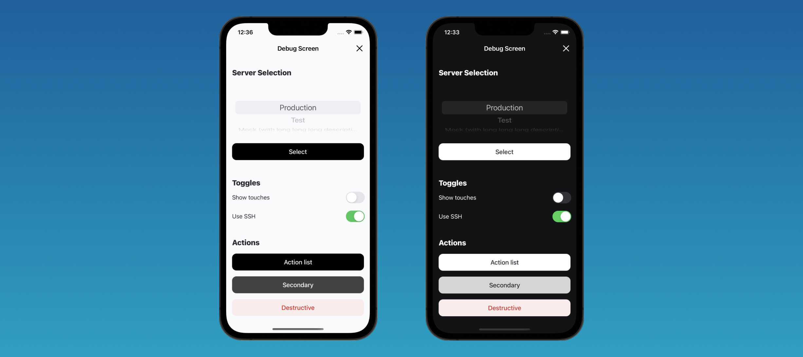

# DebugScreen

[](https://github.com/surfstudio/debug-screen-ios/actions/workflows/main.yml)
[](https://github.com/apple/swift-package-manager)
[](https://cocoapods.org)
[]()
[](https://github.com/surfstudio/debug-screen-ios)

## About

Library for quickly creating and customizing an application's debug screen. It allows you to customize your DebugScreen as you want.



## Installation

#### Swift Package Manager

- Open your Xcode project and select `File > Add Packages...`
- Enter repository URL `https://github.com/surfstudio/DebugScreen`

#### CocoaPods:

Add following string into your Podfile and run `pod install` command:

```ruby
pod 'DebugScreen'
```

## Features

Library has different components for create debug screen with functionality that you need.

### Available blocks

- **Action** - Allows you to perform some action on button tap
- **ActionsList** - Provides custom actions list, that will be opened on button tap
- **CopiedText** - Allows to add tapable text, that will be copied to clipboard on tap
- **FeatureToggle** - Provides toggles for activate / disable your application features
- **SelectionList** - Allows you to implement element selection from list (using UIPickerView)

Also library has ready-to-use components, can be used for building logger section.

### Services

- **Logger** - Allows you to catch and get all logs from the Xcode console output
- **Presenter** - Provides functionality for open DebugScreen, logs file and show simple alerts with messages 

## Usage

All of this you can see in our Example-project. Download repository and run command `make init` before start. It's needed for project correct setup and work.

Check out the full documentation [here](https://surfstudio.github.io/debug-screen-ios/documentation/debugscreen/).

## Changelog

The full list of changes can be found in this [file](./Changelog.md).

## License


[MIT License](./LICENSE)
